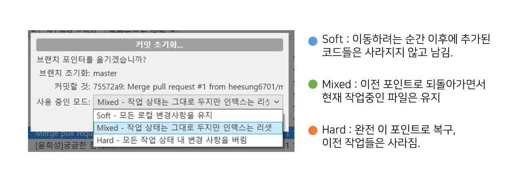
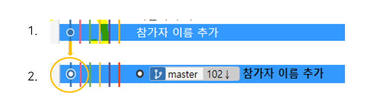
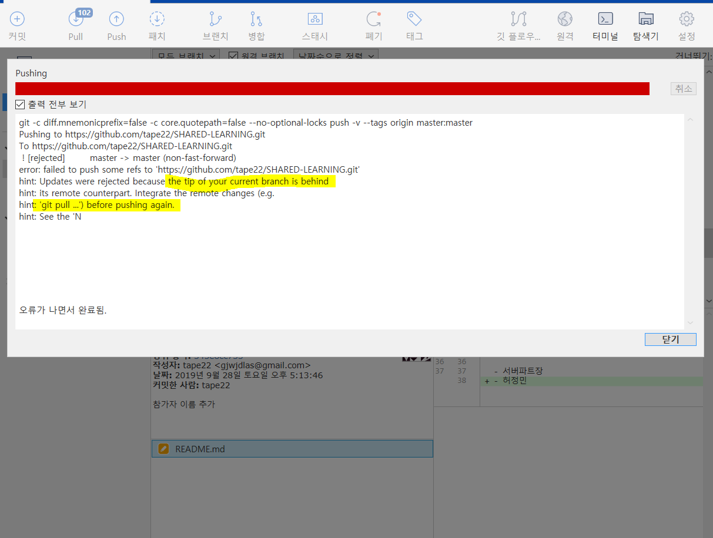
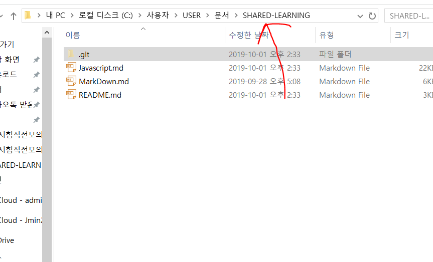
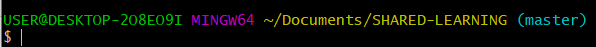
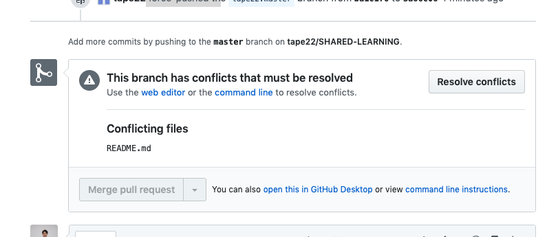
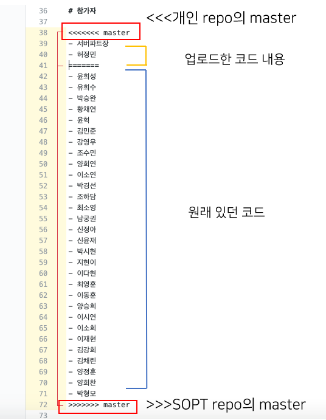

#  GitHub commit 이전으로 복구하기

 1차 세미나 과제를 수행하면서 오류가 발생했었는데, 파트장 님과 해결 과정 내용을 공유합니다.


 - 에러 상황
   1. 커밋해야하는 내용 이외의 내용을 커밋함.
   2. SOPT 공간의 README 파일과 PullRequest 올린 README파일이 충돌이 남.


# 1. 특정 커밋 이전으로 복구하기

  먼저 소스트리에서 복구 시도를 해봅니다. 

 맨 왼쪽 파란색 선에서 자신이 되돌리고 싶은 곳에서 우클릭 후 

 'master을 이 커밋으로 초기화' (혹은 '이 커밋까지 현재 브런치 초기화')를 누르면  soft/mixed/hard 옵션이 나옵니다.

 


 이 작업은 local에서 작업하는 것이기 때문에 다른 사람들의 작업은 날아가지 않습니다. 여기서는 이후의 내용은 다시 pull해올 수 있기 때문에 hard로 진행했습니다.


 hard 옵션을 누르면 보시는 바와 같이 master 태그가 이동한 것을 볼 수 있습니다. 그리고 그 상태에서 push를 누르면 master이 있는 부분까지 workspace 환경이 돌아갑니다.

 


# 1-1.  소스트리에서 해결이 되지 않는 경우

 하지만 소스트리 내에서 진행하면 local에서만 되돌리기를 진행했기 때문에 push에서 에러가 나는 경우가 있습니다.


  


따라서 여기서부터는 git bash로 진행하겠습니다.

소스트리 파일상태-> 익스플로러에서 열기-> 맨 위에 프로젝트 경로
를 확인하고 

git bash 내에서 해당 프로젝트 경로로 이동합니다.


저처럼 그냥 폴더 경로를 찾아서 해도 상관 없습니다.


 

 


 git bash에서 소스트리 push 버튼과 같은 역할을 하는 것은 다음과 같은 명령어입니다.

```   

git push origin master
git push -f origin master    /* 강제로 덮어씌우는 명령어 -f */

```   

-f 명령어는 조심해서 사용해야 하므로 revert를 활용해서 수정할 수 있지만 지금은 -f를 써서 복구시켜보겠습니다.


** revert를 사용해서 복구하는 방법은 다음 글을 참고해 주시길 바랍니다.

[원격 저장소에 올라간 커밋 되돌리기](https://jupiny.com/2019/03/19/revert-commits-in-remote-repository/)

이후에 다시 개인 레포지토리로 돌아가서 pull Request를 누르면 페이지가 이동하면서 충돌 부분을 수정하면 됩니다.


# 2. 충돌 수정하기


 1번을 진행하고 보면 맨 마지막에 이런 문구가 나오는 것을 확인할 수 있습니다.

 

이것은 아래 그림과 같이 각 공간의 README.md 파일 내용이 겹치거나 충돌이 있기 때문에 수작업으로 수정해야한다는 것을 의미합니다.

resolve conflicts를 눌러서 보면 다음과 같이 나옵니다.
현재 수정을 위해서는 위 아래의 master, ===과 지울 내용을 지우면 오른쪽의 Commit merge 버튼이 활성화됩니다.

 

버튼을 누르면 충돌 관련된 수정도 완료가 되어 이전 상태로 복구됩니다.


# 3. 현재 Pull Request를 쓰는 이유

 Pull Request를 사용하는 이유는 이렇게 중간에 잘못된 부분이 바로 적용되는 것을 방지하기 위해 

코드 변경사항을 커밋으로 확인하고

고칠 부분을 수정을 다시해서 최종적으로 merge하기 위함입니다.

