# GitHub Desktop

소스트리에서 commit error가 발생하기 때문에 또다른 Git GUI Tool인 Git Kraken을 소개하려고 합니다.

GitHub Desktop은 Window, Mac 운영체제를 지원하며 Linux 운영체제는 따로 지원하지 않습니다.

### 1. GitHub Desktop 설치

link : https://desktop.github.com/

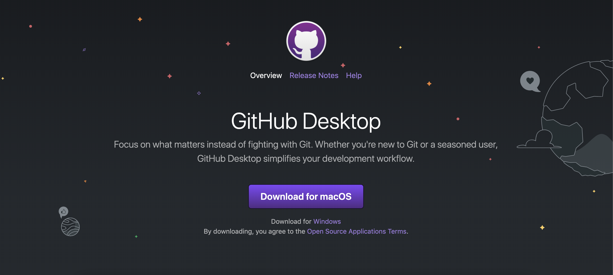

2.  Add Account

설치를 하면 아래와 같은 화면이 나옵니다.

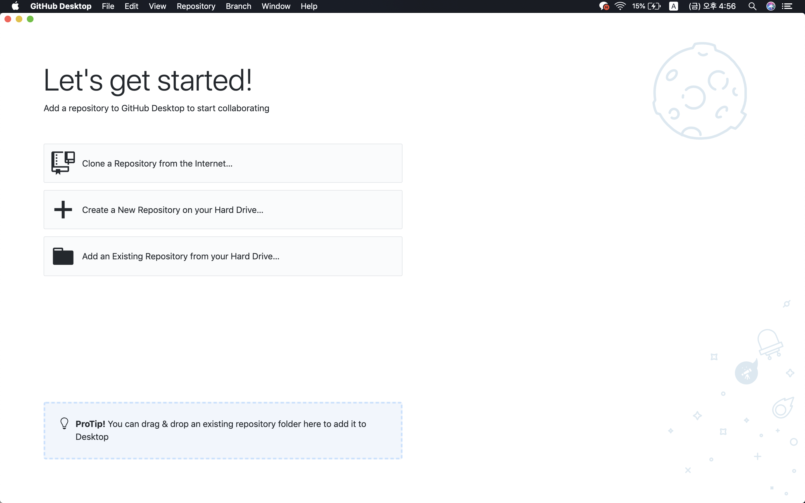

일단 설치를 했으니 자신의 계정을 추가해볼게요!

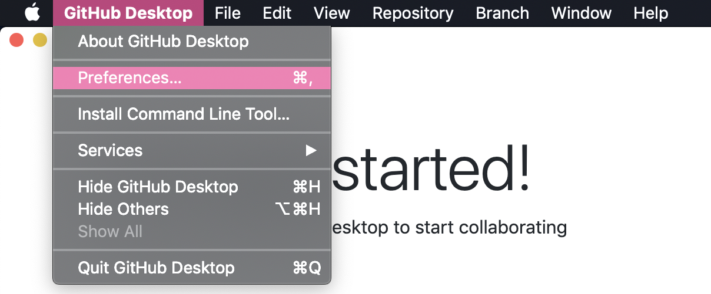

도구창에서 Preferences...를 찾아주시고, 깃허브 계정과 연결시켜 주시면 됩니다.

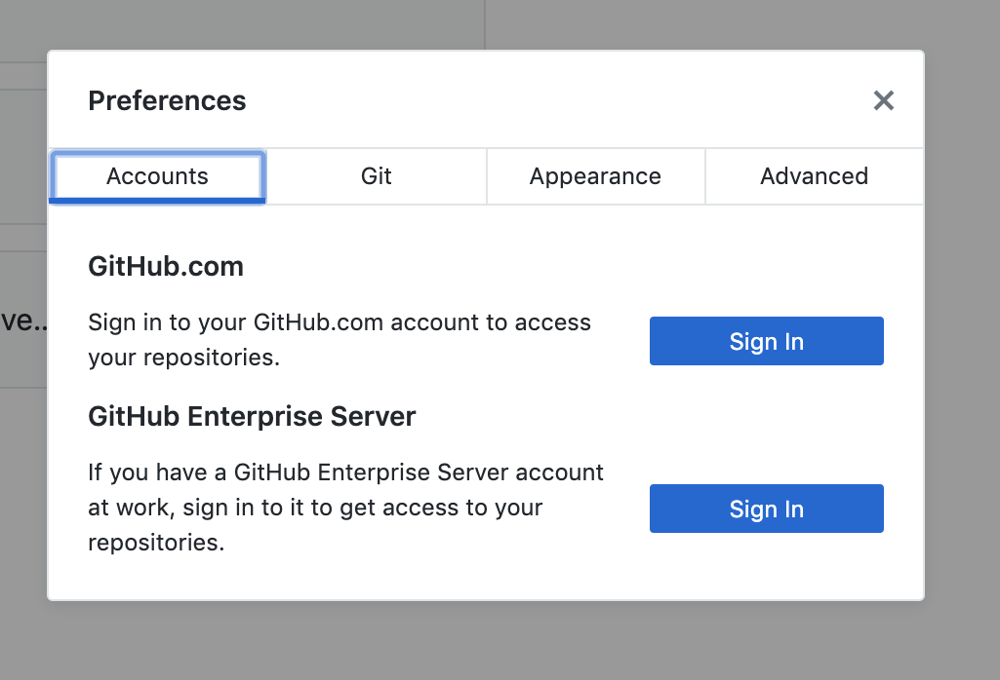

이런 창이 뜰 텐데요 Accounts > Github.com > Sign In 에 로그인하고 난 후,

 Git 에 있는 Name 과 Email 도 다시 한 번 확인하고 적어주시면 됩니다 ~!


### 3. Open Repo

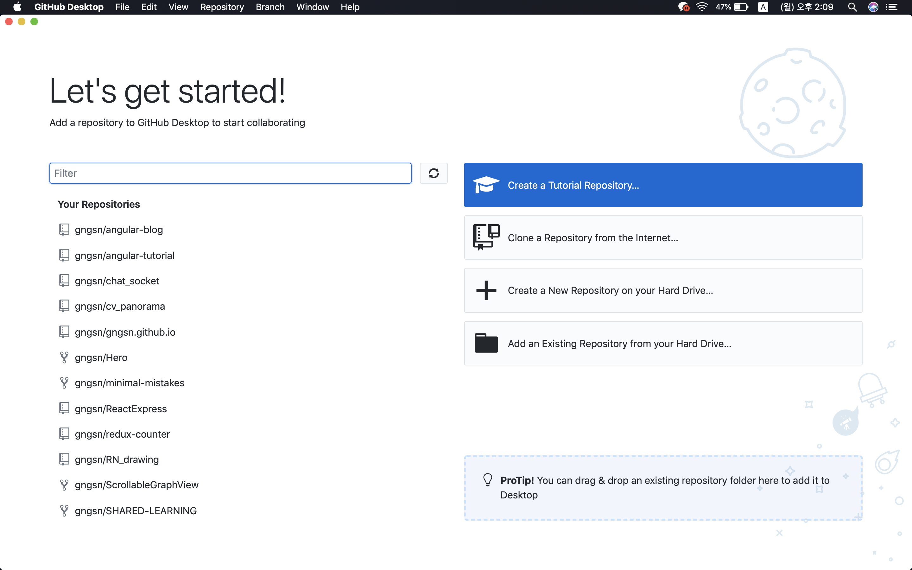

계정을 추가하면 화면이 다르게 표시됩니다! 화면에는 세 개의 표시가 뜹니다.

1. Clone a Repository from the internet

   : 자신의 깃허브 계정에 있는 repository를 자신의 로컬에 받아오고 싶을 때 사용합니다. 

2. Create a New Repository on your Hard Drive

   : 새로운 repository를 만들어서 새로 작업합니다.

3. Add an Existing Repository from your Hard Drive

   : local에 저장되어있던 repository를 불러옵니다.


####Clone a Repository from the internet 

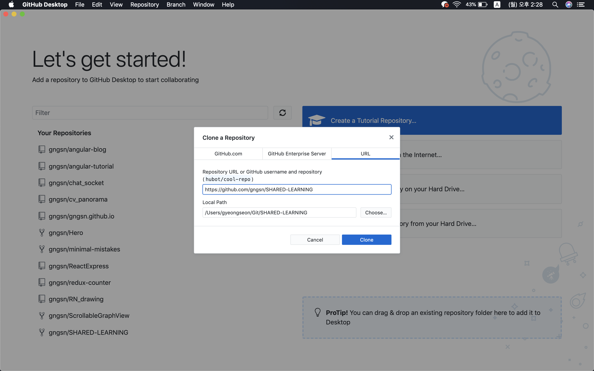

가지고 오고 싶은 repository의 주소를 입력해줍니다! 이때 URL 혹은 username/repository로 입력합니다.

``` 
https://github.com/gngsn/SHARED-LEARNING.git			(X)
https://github.com/gngsn/SHARED-LEARNING				  (O)

/gngsn/SHARED-LEARNING														(X)
gngsn/SHARED-LEARNING												   		(O)
```

local Path에는 자신이 저장하고 싶은 위치로 이동하면 돼요 〰️ 

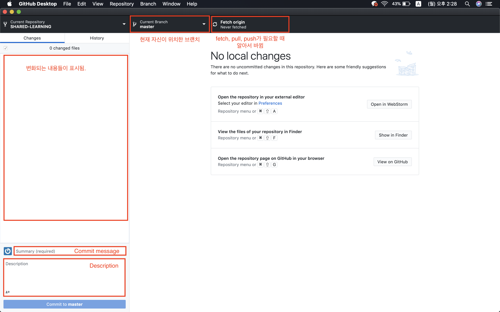

처음엔 fetch origin을 한 번 눌러주세요.

그 이후부터는 자신의 가져온 파일을 원하는대로 업데이트 시키면 됩니다!

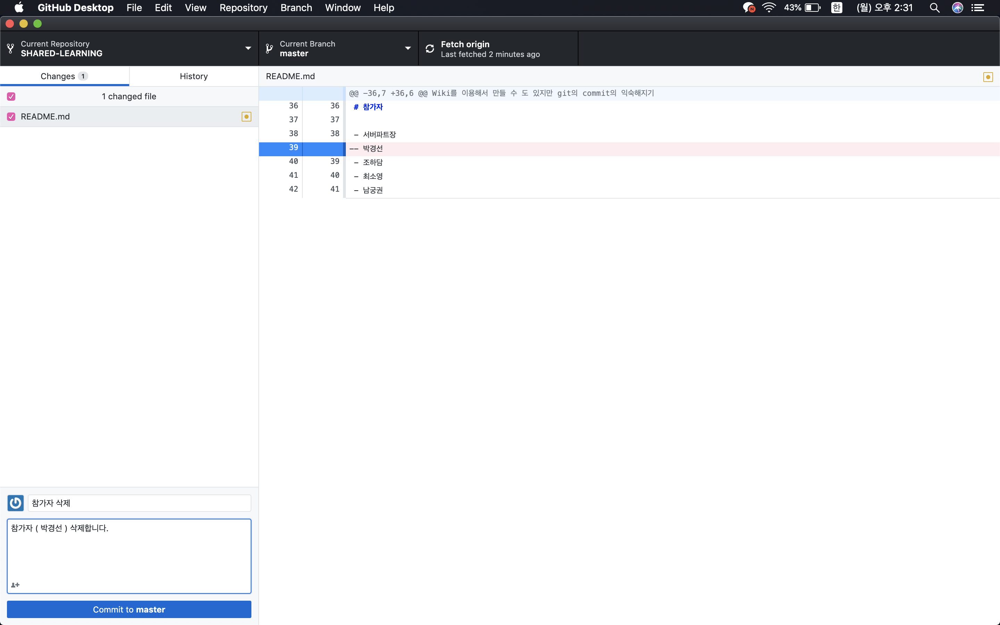

변경되면 이렇게 변경된 사항이 표시되고, 아래 commit message와 Description( 생략 가능 )을 작성해서 commit to ~~ 을 눌러주세요! ( 커밋 날리는 과정 )

그럼 이후에 Fetch origin 자리가 pull 로 바뀌게 되고, 누르면 푸시됩니다 ~


### 4. Branch

#### (1) Branch 만들기

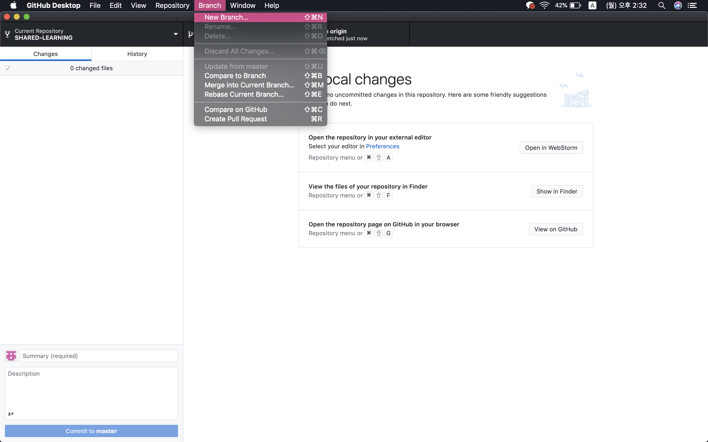

도구창 > Branch > New Branch 를 누르고 설정을 입력해줍니다.

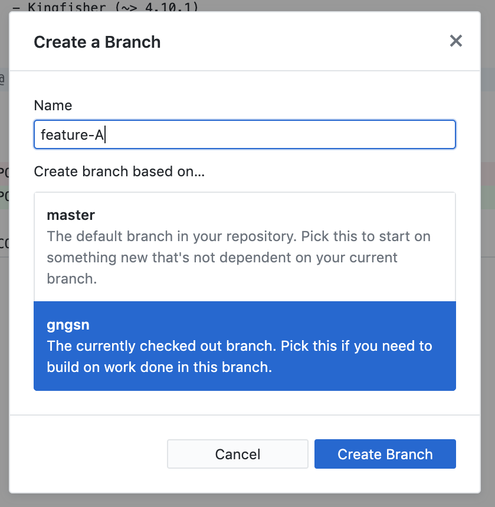

브랜치의 이름을 지정해준 뒤, 어디서 브랜치를 따올지 선택해서 만들면 끝 ~.~

브랜치를 바꿀 때는

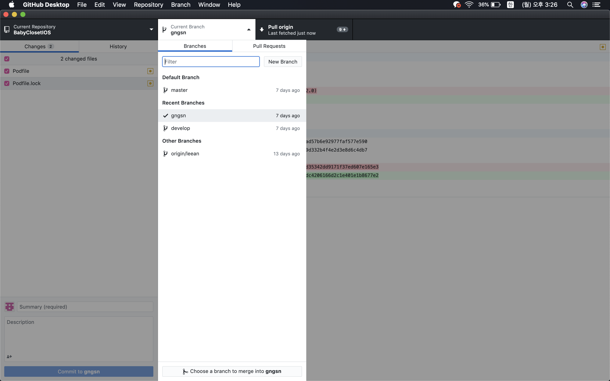

위처럼 브랜치의 리스트가 나오게 되고, 원하는 브랜치를 선택하면 됩니다!
