# GitKraken
소스트리에서 commit error가 발생하기 때문에 또다른 Git GUI Tool인 Git Kraken을 소개하려고 합니다.

Git Kraken은 Window, Mac, Linux 운영체제를 지원하며 Free, Pro, Enterprise 세가지 버전이 존재합니다.
저희는 이중에서 Free버전을 사용하면 됩니다.

1. GitKraken 설치

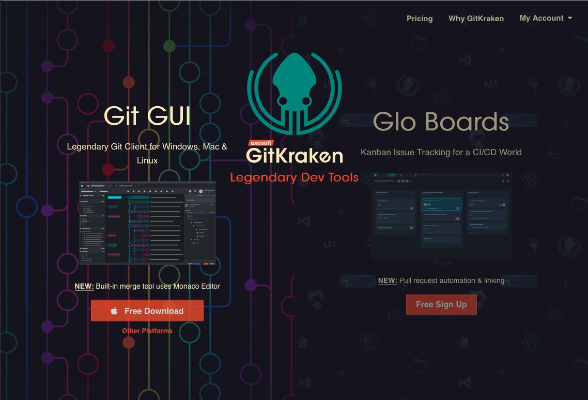
[설치 링크](https://www.gitkraken.com)

2. Open a Repo

설치를 하면 아래와 같은 화면이 나옵니다.

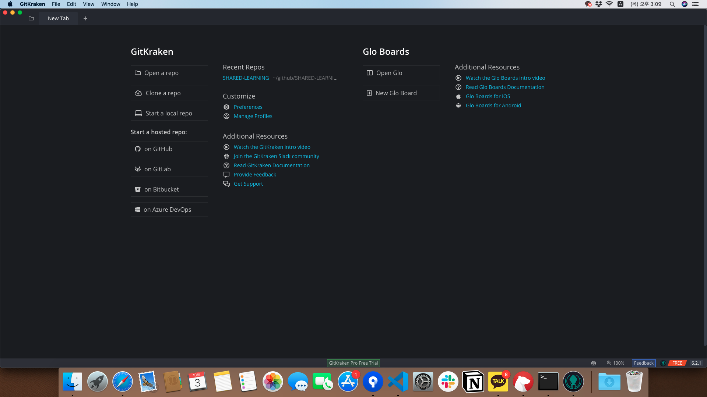

여기서 3가지 방법이 존재하는데

- Open a Repo: Local에 존재하는 Repo를 열어 줍니다.
- Clone a Repo: Remote에서 local로 복제합니다.
- Start a local Repo: 새로운 Repo를 local에 생성합니다.

이미 SourceTree를 이용해서 clone을 하였다면  Open a Repo를 이용할 수 있으며 SourceTree에서 Clone를 하지 않았다면 Clone a Repo를 이용하면 됩니다.

Open a Repo를 이용할 경우에는 Clone을 진행했던 경로의 폴더를 선택해주면 됩니다.

3. Git Kraken 화면 구성

Repo를 열면 아래와 같은 화면이 나오게 됩니다.
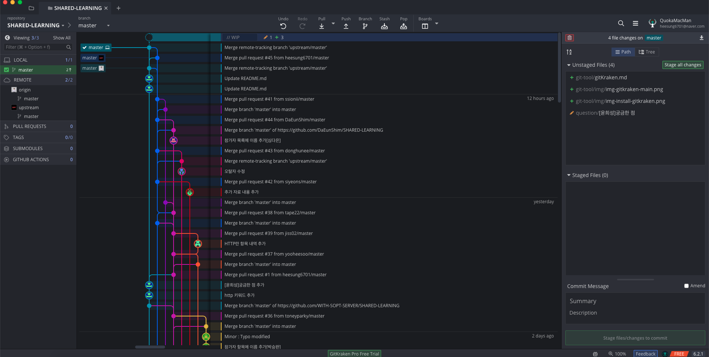

- 먼저 좌측 상단을 보면 아래와 같은 화면을 볼 수 있습니다.

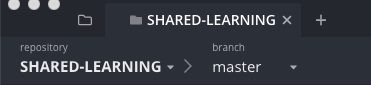

이는 현재 SHARED-LEARNING이라는 Repository의
master branch에 위치하고 있음을 보여줍니다.
즉 어떤 Repo의 어떤 branch에 위치했는지 알 수 있습니다.

- 그 다음에 오른쪽으로 넘어가면 다양한 버튼이 있습니다.

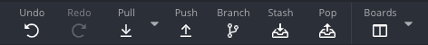

각각 git 명령어에 해당하는 기능을 가지고 있으며 우선 Push, Pull 정도만 알 고 있으셔도 됩니다.

(git을 공부하시면 branch, stash등에 대해서도 알 수 있게 됩니다!)

- 그 다음은 화면 좌측에 창을 보겠습니다.

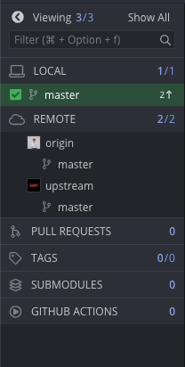

여기서 알 수 있는 것은 LOCAL과 REMOTE의 Branch등을 볼 수 있습니다.
현재 스크린샷에서는 LOCAL에 master라는 branch가 있으며 원격으로는 origin과 upstream이라는 2개의 Remote Repository에 연결 되어있는것을 확인할 수 있습니다. (origin은 개인 Repo, upstream은 솝트 Repo에 연결되어 있습니다.)

만약 솝트 Repo(WITH-SOPT-SERVER)이 추가 되어있지 않았다면 REMOTE에 마우스를 올려서 +를 클릭해서 추가하시면 됩니다.

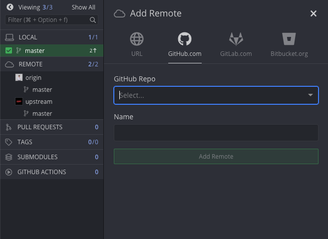

Github Repo: `https://github.com/WITH-SOPT-SERVER/SHARED-LEARNING`

Name: `upstream`

- 가운데 화면을 보시면 화려한 GUI를 확인할 수 있는데 이는 현재에 이르기 까지 쌓여온 commit과 branch를 확인할 수 있는 History 기능입니다.

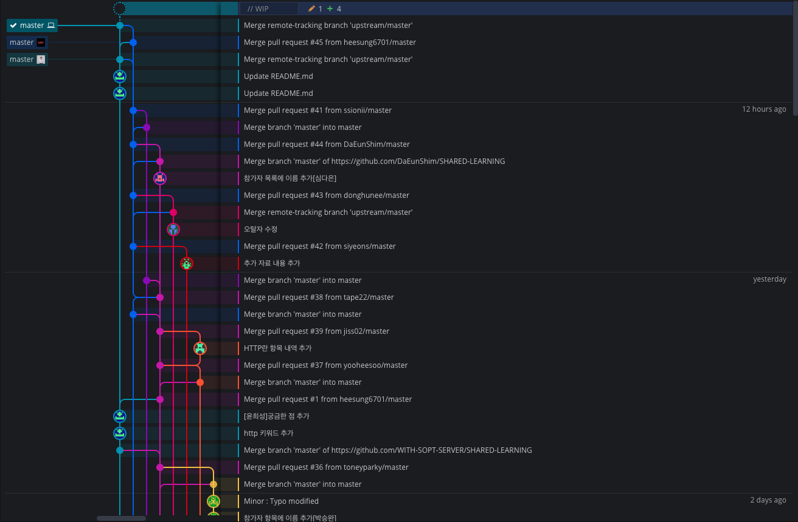

- 오른쪽을 보면 변경된 코드와 commit된 코드를 볼 수 있습니다.

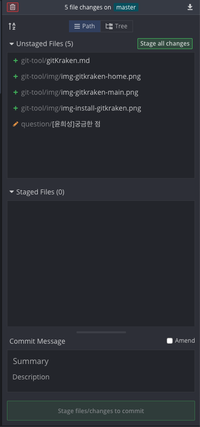

Unstaged Files는  변경사항이 git에서 등록되지 않은 상태이며 Staged Files는 commit을 통해서 push를 할 준비가 된 변경사항들입니다.

Unstaged Files에서 commit할 파일을 선택하시고 우측 상단에 Stage * file를 클릭해주시면 됩니다.

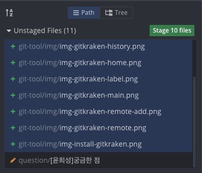

이후 Commit Message에 Summary와 Description을 설정하고 아래 버튼을 누르면 commit이 됩니다.

- Remote Repo로 Push

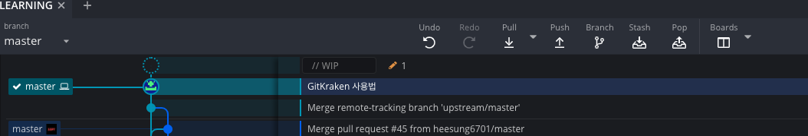

새로운 커밋이 추가되는 것을 확인할 수 있습니다.
그리고 상단에 push 버튼을 누르면 원격 Repo로 변경사항이 적용됩니다.

- REMOTE에서 최신 버전 Pull 하기
좌측에서 가져오고자 하는 REMOTE Repository에서 branch를 선택한 후 우클릭을 하면 아래와 같은 화면이 나옵니다.

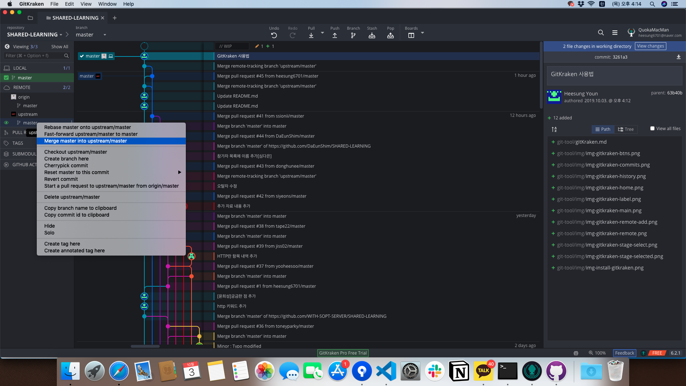

merge A into B라는 항목을 확인할 수 있는데
A에 정보를 B에 합친다는 merge명령어를 의미합니다.
이를 실행하면 서버에 적용된 변경사항을 LOCAL에도 적용시킬 수 있습니다.

